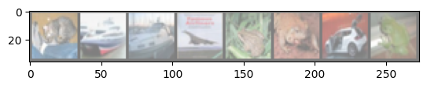

# Is Data Augmentation Really Necessary?
Denoise-Then-Classify Approach on CIFAR10

CS 497 Final Project

In the repository, the "models.py" file contains the source code for all the utilized models. The "main.ipynb" notebook provides an easy way to reproduce all experiments. 

### 1. Introduction

### 2. Procedures
#### 2.1. Model I: Baseline
This model is designated as the Baseline Classifier. It is trained exclusively with clean images and features an architecture consisting of a Convolutional Neural Network (CNN) followed by a Transformer encoder and a linear output head.
#### 2.2. Model II: Denoise-then-Classify Approach
Model II introduces a denoise-then-classify strategy, training the denoiser on perturbed images while employing the same classification model as used in Model I, aiming to improve robustness against noise. The architecture of the denoiser or noise predictor is a U-net that takes in the noisy images and the perturbation level and outputs the added noise.
#### 2.3. Model III: Dataset Augmentation Approach
The Dataset Augmentation Approach is embodied in Model III, which utilizes a classifier of identical architecture to Model I. This model's training set is expanded to include both original and perturbed image, enhancing its ability to generalize from varied data inputs.
#### 2.4. Model IV: Joint Training Approach
Model IV maintains the architectural design of Model II but diverges in its training methodology by jointly training the denoiser and classifier components, rather than in a sequential manner. This integrated approach serves as an upper bound in comparisons.
#### 2.5 Perturbation Level Adjustment in Training
The perturbation level (t), representing noise variance, is strategically varied to incorporate curriculum learning principles, aiming to enhance model robustness without overfitting to a specific t value. For the denoiser model, t is reduced from 0.3 to 0.05, sharpening its precision with decreasing noise levels. In contrast, for the Data Augmentation and Joint Training approaches, t increases from 0 to 0.3, exposing models to a wider range of noise. This gradual adjustment of t enhances models' robustness to handle various perturbation levels.
#### 2.6 Adversarial Part
During the final project proposal presentation, a compelling observation was made: adding a new model to the forefront and claiming it enhances robustness against adversarial attacks, when these attacks primarily target the latter part of the model, misses the point. In response to this insightful feedback, my strategy is adopted to produce adversarial examples across all four models to conduct a comprehensive comparison. The hypothesis I aim to test is that adversarial examples generated against both the denoise-then-classify and the jointly-trained models will result in significantly more detectable noise.
##### update
The adversarial generation method I implemented needs to take the perturbation level as an input. Therefore, I adapted the method here to use the same adversarial attack algorithm with the same perturbation level and compare the success rate at which each output label remains unflipped.
### 3. Results (To be Continued)
#### 3.1 Accuracy On Clean And Noisy Images

The bar chart presents the accuracy of four different models on the CIFAR10 dataset, comparing performance on both clean and noisy data. The noisy images are constructed using perturbation level t = 0.3.

The Baseline Classifier shows a significant drop in performance with noisy images. It has the highest accuracy on clean data at 63%, but this decreases to 29% with noise, indicating a bad robustness to noise perturbations.

The Denoise-Then-Classify Approach shows an improved robustness to noise with a smaller gap between clean (45%) and noisy (50%) accuracy. 

The Data Augmentation Approach shows a better performance in both clean and noisy images in comparison with the Denoise-then-classify approach.

The joint training approach shows nearly identical performance on the clean and noisy dataset, indicating the best robustness.
#### 3.2 Robustness to Different Nosie Level

### 3.3 Adversarial Part

### 3.3 
### 4. Analysis
#### 4.1 

#### 4.2 

### 5. Conclusion and Future Work

